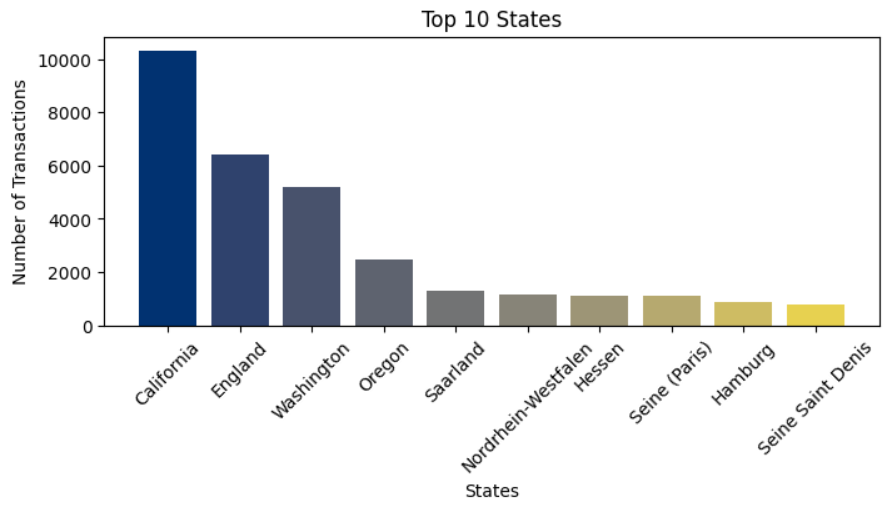

#  Introduction
This project explores a sales dataset and demonstrates how to conduct economic data analysis using Python. Below, you will find information about the data, how to set up and run the project, and a brief overview of the analysis results.

#  Data Overview
The dataset represents a series of sales transactions recorded by date, including fields for customer demographics, product details, and financial metrics 1
. Each row in the dataset contains:
-   Date, Year, and Month: The time of the transaction.
-   Customer Age and Customer Gender: Demographic information.
-   Country and State: Geographic location of the sale.
-   Product Category and Sub Category: Type of product sold (e.g., Accessories, Clothing, etc.).
-   Quantity: Number of items purchased in the transaction.
-   Unit Cost and Unit Price: Cost to the business and retail price per item.
-   Cost and Revenue: Total cost and revenue for each transaction, allowing for analysis of profit margins.

This structure makes it possible to explore sales patterns over time, compare customer segments, evaluate product performance, and assess profitability

# Getting Started
### Prerequisites

- Python 3.7+
- pip (Python package installer)

### Clone the Repository
```bash
git clone https://github.com/yourusername/Sales-Data-for-Economic-Data-Analysis.git
cd Economic_data_analysis
```

### Install the required packages

   ```bash
   pip install -r requirements.txt
   ```

### Running the notebook
1. **Navigate to the Notebooks directory:**

   ```bash
   cd Notebooks
   ```

2. **Launch Jupyter Notebook:**

   ```bash
   jupyter notebook
   ```

3. Run the cells to get the statistical and exploratory data analysis of the data


# Results

## Structural Information


A correlation matrix heatmap showing relationships between various sales metrics. Strong positive correlations (shown in red) exist between Unit Cost, Unit Price, Cost, and Revenue (0.83-0.98), while other variables like Year and Customer Age show weak correlations with financial metrics.

## Customer Demographics
1. Gender Distribution(Male/Female)


A bar chart comparing customer counts by gender, showing a relatively even distribution between male and female customers, with males having a slightly higher representation (approximately 17,500 customers) compared to females (approximately 17,000 customers).

2. Detecting outliers in age column


   

A box plot showing the distribution of customer ages, with the majority concentrated between approximately 30-40 years old. Several outliers are visible beyond age 70, indicating a small number of elderly customers.

3. Customer age Distribution
   


A pie chart breaking down customer age segments, showing that young adults and middle-aged customers (20-40 years) make up 60.5% of the customer base, followed by ages 40-60 at 31.5%, while younger (0-20) and older (60-80) customers represent smaller segments at 5.8% and 2.2% respectively.

##   Product Distribution


A detailed breakdown of product subcategories color-coded by main categories (Accessories, Clothing, Bikes). Tires and Tubes dominates the Accessories category with over 10,000 units, followed by Bottles and Cages (~6,000) and Helmets (~4,000). In Bikes, Road Bikes and Mountain Bikes show similar counts around 3,000 units each.

##   Revenue and Profit Analysis

1.   Top 10 states across the world with most transactions



A declining bar chart showing transaction counts across states. The first state leads with approximately 10,000 transactions, followed by a significant drop to around 6,000 for the second state. The remaining states show a gradual decrease in transaction volume, with the tenth state recording about 1,000 transactions.

2.   Profits across different countries
   


A bar chart comparing profits across four major countries. Germany leads with approximately 950,000 in profits, followed by the United States with around 700,000. France and the United Kingdom show lower profits at approximately 270,000 and 320,000 respectively.

3. Revenue and Profit Trend


A line graph showing the annual revenue and profit trends across months. Revenue (orange line) peaks around May at 2.5M, followed by a sharp decline in July to about 1.3M, before rising again in December to 2M. Profit (blue line) remains relatively stable between 200-400K in the first half of the year, then decreases to around 100K for the latter half.


##   Conclusion
The analysis of the sales dataset reveals several key insights:
-   Temporal Patterns
1.   Revenue shows strong seasonality with a peak in May (~2.5M) and December (~2.1M), while experiencing a significant dip in July.
2.   Profit margins were healthiest in the first half of the year, maintaining between 200-400K monthly, before declining in the latter half.

-   Geographic Performance
1.   Germany emerges as the strongest market with approximately 950K in profits
2.   The United States follows as the second-largest market (~700K in profits)
3.   The UK and France contribute smaller but significant profits (~320K and ~270K respectively)

-   Business Insights
1.   The business demonstrates strong revenue generation but shows room for improvement in profit margins
2.   There's a clear opportunity to investigate and potentially replicate Germany's success factors in other markets
3.   The significant mid-year performance drop suggests a need for targeted strategies to maintain momentum throughout the year

-   These findings can help inform strategic decisions for:
1.   Inventory management during peak seasons
2.   Market-specific expansion strategies
3.   Profit margin optimization
4.   Seasonal marketing campaigns
The analysis provides a foundation for data-driven decision-making to improve overall business performance and market penetration.
